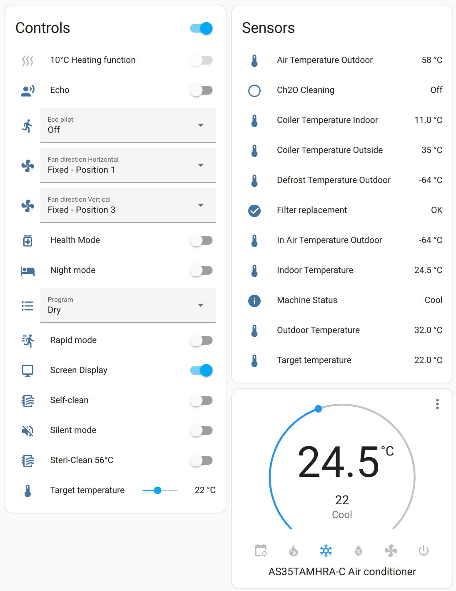
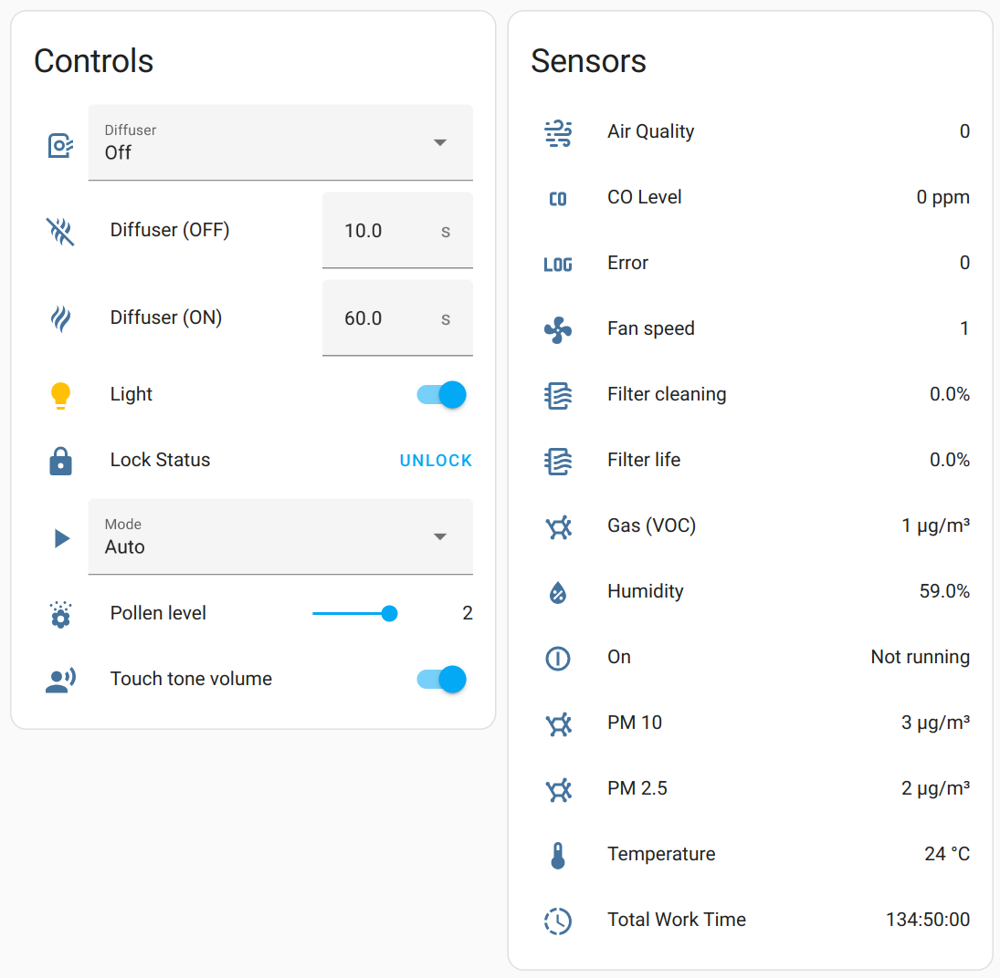
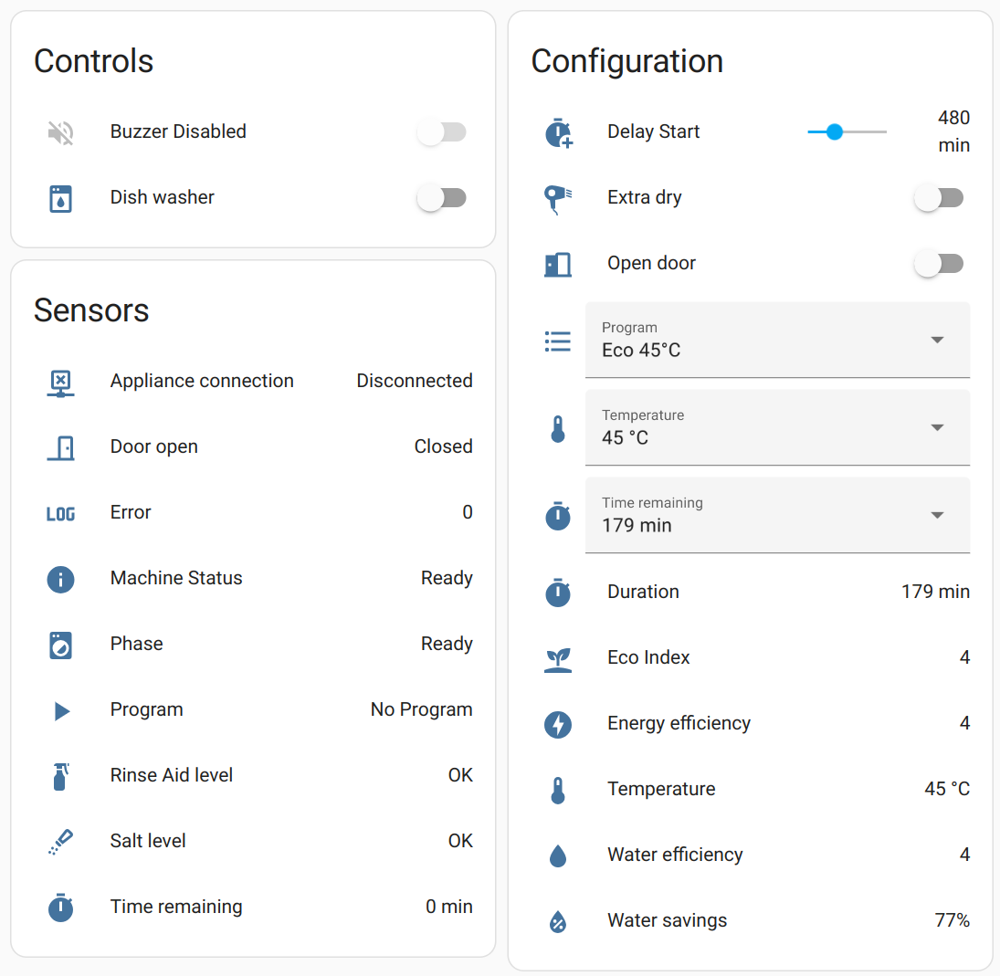
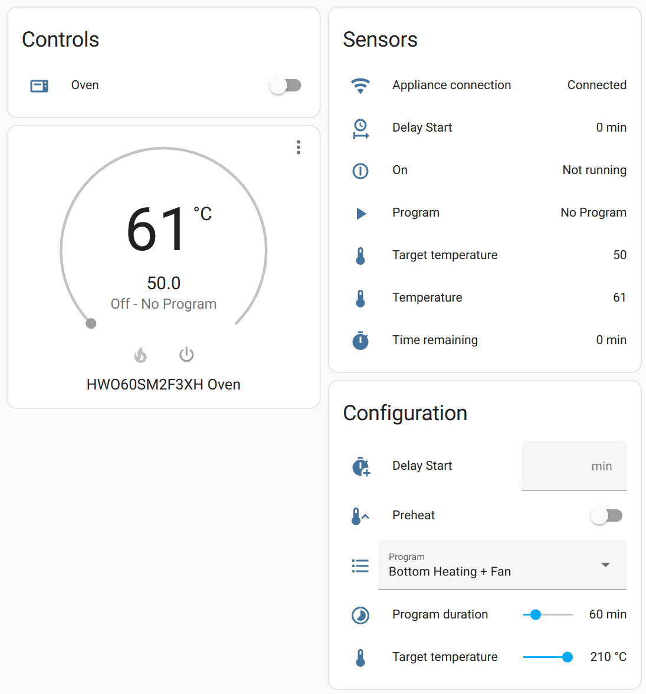
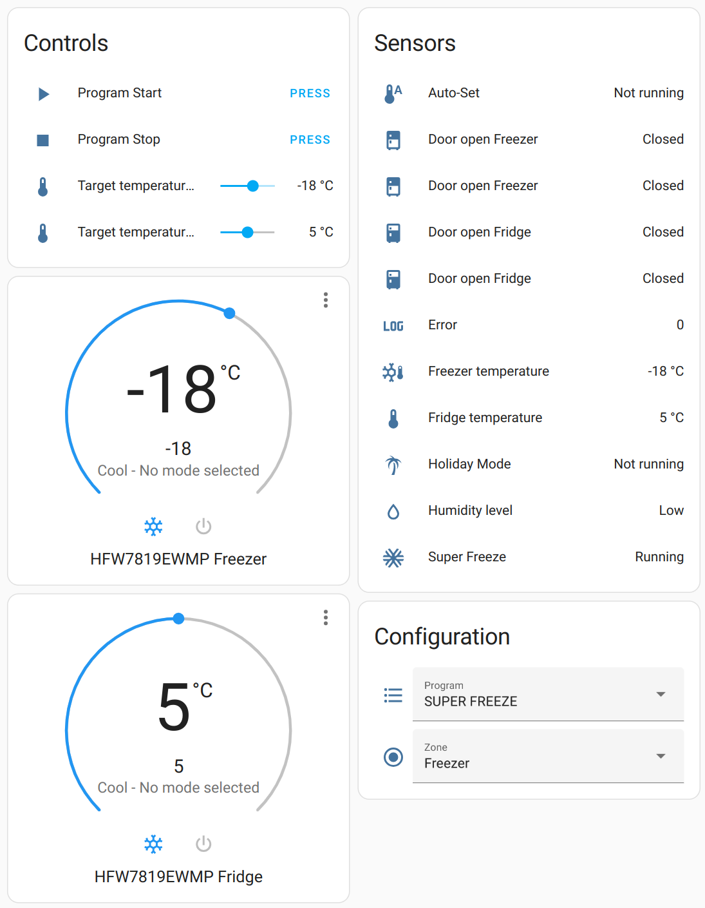
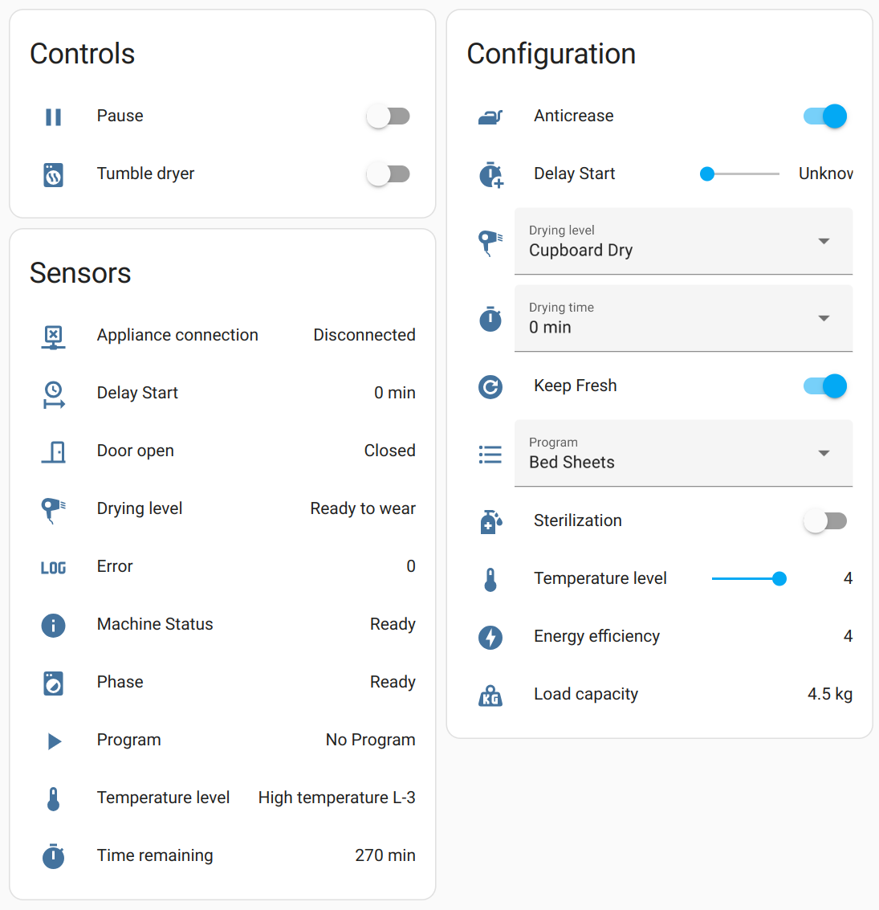
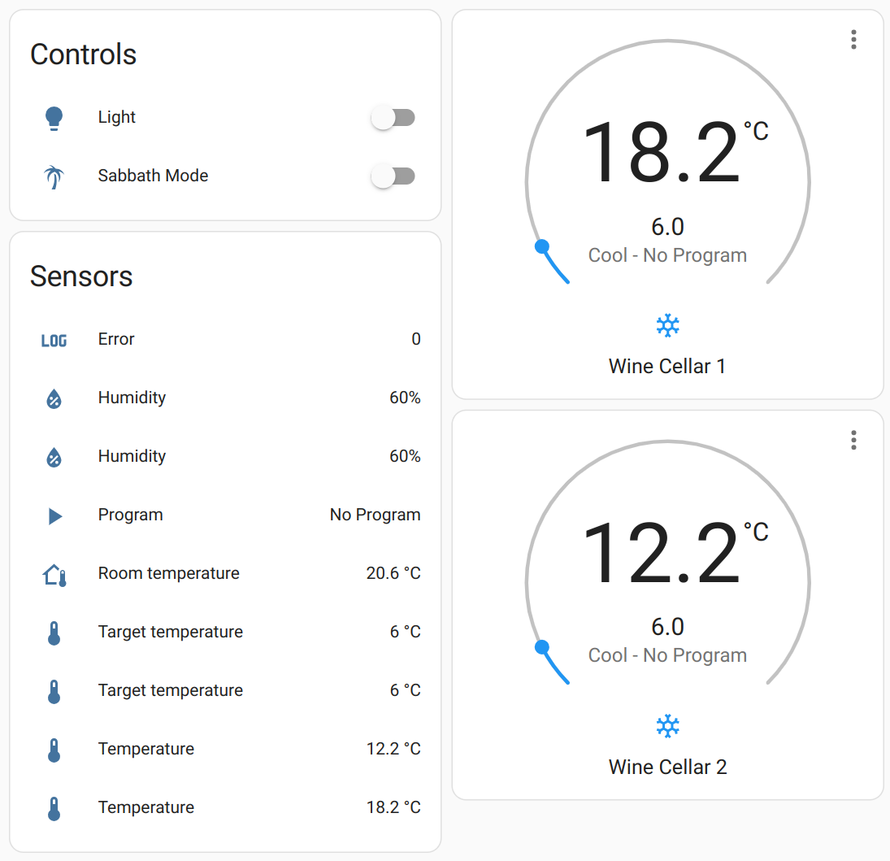
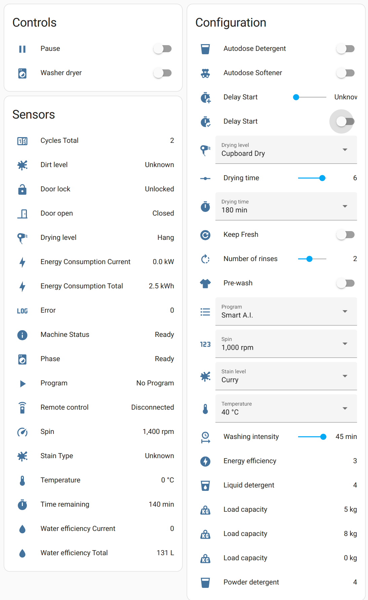
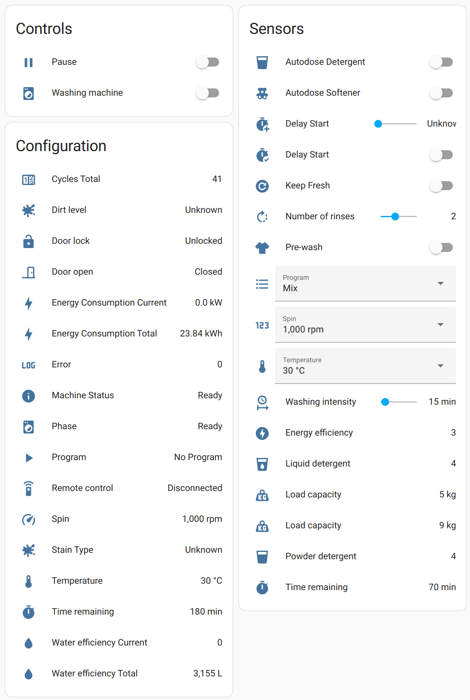

# Haier hOn
[](https://hacs.xyz)
[](https://github.com/Andre0512/hon/blob/main/LICENSE)
[](https://github.com/Andre0512/hon/actions/workflows/python_check.yml)
[](https://www.buymeacoffee.com/andre0512)  
[](https://github.com/Andre0512/hon/releases/latest)
[](https://tooomm.github.io/github-release-stats/?username=Andre0512&repository=hon)
[](https://tooomm.github.io/github-release-stats/?username=Andre0512&repository=hon)

---

Home Assistant integration for [Haier's mobile app hOn](https://hon-smarthome.com/) based on [pyhOn](https://github.com/Andre0512/pyhon).

---


[](https://github.com/Andre0512/hon#supported-languages)
[](https://github.com/Andre0512/hon#supported-appliances)
[](https://github.com/Andre0512/hon#supported-appliances)
[](https://github.com/Andre0512/hon#supported-appliances)

## Takedown Story
Haier sent a takedown notice and threatened legal action. The community started a big riot and called for a Haier boycott, the repository was forked over 2000+ times to make the code undeletable. Haier starts a dialog to find a joint solution. Read all about it here:  
- [Timeline of events](https://github.com/Andre0512/hon/blob/main/takedown_timeline.md)
- [Takedown FAQs](https://github.com/Andre0512/hon/blob/main/takedown_faq.md)
- [Main discussion](https://github.com/Andre0512/hon/issues/147)
- [Summary video](https://www.youtube.com/watch?v=ayG7o74kdbc)
- [Haier's Statement](https://github.com/Andre0512/hon/issues/147#issuecomment-1923622715)

## Supported Appliances
_Click to expand..._

<details>
<summary>Air Conditioner</summary>

### Air Conditioner Example


### Supported Air Conditioner models
Support has been confirmed for these **22 models**, but many more will work. Please add already supported devices [with this form to complete the list](https://forms.gle/bTSD8qFotdZFytbf8).

#### Haier
- AD105S2SM3FA
- AD71S2SM3FA(H)
- AS07TS4HRA-M
- AS07TS5HRA
- AS09TS4HRA-M
- AS25PBAHRA
- AS25S2SF1FA
- AS25TADHRA-2
- AS25TEDHRA(M1)
- AS25THMHRA-C
- AS25XCAHRA
- AS35PBAHRA
- AS35S2SF1FA
- AS35S2SF2FA-3
- AS35TADHRA-2
- AS35TAMHRA-C
- AS35TEDHRA(M1)
- AS35XCAHRA
- AS50S2SF1FA
- AS50S2SF2FA-1
- AS50XCAHR

#### Candy
- CY-12TAIN

### Air Conditioner Entities
#### Controls
| Name | Icon | Entity | Key |
| --- | --- | --- | --- |
| 10° Heating | `heat-wave` | `switch` | `10degreeHeatingStatus` |
| Air Conditioner | `air-conditioner` | `climate` | `settings` |
| Echo | `account-voice` | `switch` | `echoStatus` |
| Eco Mode | `sprout` | `switch` | `ecoMode` |
| Eco Pilot | `run` | `select` | `settings.humanSensingStatus` |
| Fan Direction Horizontal | `fan` | `select` | `settings.windDirectionHorizontal` |
| Fan Direction Vertical | `fan` | `select` | `settings.windDirectionVertical` |
| Health Mode | `medication-outline` | `switch` | `healthMode` |
| Night Mode | `bed` | `switch` | `silentSleepStatus` |
| Rapid Mode | `run-fast` | `switch` | `rapidMode` |
| Screen Display | `monitor-small` | `switch` | `screenDisplayStatus` |
| Self Cleaning | `air-filter` | `switch` | `selfCleaningStatus` |
| Self Cleaning 56 | `air-filter` | `switch` | `selfCleaning56Status` |
| Silent Mode | `volume-off` | `switch` | `muteStatus` |
| Target Temperature | `thermometer` | `number` | `settings.tempSel` |
#### Sensors
| Name | Icon | Entity | Key |
| --- | --- | --- | --- |
| Air Temperature Outdoor | `thermometer` | `sensor` | `tempAirOutdoor` |
| Ch2O Cleaning |  | `binary_sensor` | `ch2oCleaningStatus` |
| Coiler Temperature Indoor | `thermometer` | `sensor` | `tempCoilerIndoor` |
| Coiler Temperature Outside | `thermometer` | `sensor` | `tempCoilerOutdoor` |
| Defrost Temperature Outdoor | `thermometer` | `sensor` | `tempDefrostOutdoor` |
| Filter Replacement |  | `binary_sensor` | `filterChangeStatusLocal` |
| In Air Temperature Outdoor | `thermometer` | `sensor` | `tempInAirOutdoor` |
| Indoor Temperature | `thermometer` | `sensor` | `tempIndoor` |
| Machine Status | `information` | `sensor` | `machMode` |
| Outdoor Temperature | `thermometer` | `sensor` | `tempOutdoor` |
| Program |  | `select` | `startProgram.program` |
| Program | `play` | `sensor` | `programName` |
| Selected Temperature | `thermometer` | `sensor` | `tempSel` |

</details>

<details>
<summary>Air Purifier</summary>

### Air Purifier Example


### Supported Air Purifier models
Support has been confirmed for these **4 models**, but many more will work. Please add already supported devices [with this form to complete the list](https://forms.gle/bTSD8qFotdZFytbf8).

#### Hoover
- HHP30C011
- HHP50CA001
- HHP50CA011
- HHP70CAH011

### Air Purifier Entities
#### Controls
| Name | Icon | Entity | Key |
| --- | --- | --- | --- |
| Aroma Time Off | `scent-off` | `number` | `settings.aromaTimeOff` |
| Aroma Time On | `scent` | `number` | `settings.aromaTimeOn` |
| Diffuser Level | `air-purifier` | `select` | `settings.aromaStatus` |
| Light status |  | `light` | `settings.lightStatus` |
| Lock Status |  | `lock` | `lockStatus` |
| Mode | `play` | `select` | `settings.machMode` |
| Pollen Level | `flower-pollen` | `number` | `settings.pollenLevel` |
| Touch Tone | `account-voice` | `switch` | `touchToneStatus` |
#### Sensors
| Name | Icon | Entity | Key |
| --- | --- | --- | --- |
| Air Quality | `weather-dust` | `sensor` | `airQuality` |
| CO Level |  | `sensor` | `coLevel` |
| Error | `math-log` | `sensor` | `errors` |
| Humidity |  | `sensor` | `humidityIndoor` |
| Main Filter Status | `air-filter` | `sensor` | `mainFilterStatus` |
| On | `power-cycle` | `binary_sensor` | `attributes.parameters.onOffStatus` |
| PM 10 |  | `sensor` | `pm10ValueIndoor` |
| PM 2.5 |  | `sensor` | `pm2p5ValueIndoor` |
| Pre Filter Status | `air-filter` | `sensor` | `preFilterStatus` |
| Temperature |  | `sensor` | `temp` |
| Total Work Time |  | `sensor` | `totalWorkTime` |
| VOC |  | `sensor` | `vocValueIndoor` |
| Wind Speed | `fan` | `sensor` | `windSpeed` |

</details>

<details>
<summary>Dish Washer</summary>

### Dish Washer Example


### Supported Dish Washer models
Support has been confirmed for these **6 models**, but many more will work. Please add already supported devices [with this form to complete the list](https://forms.gle/bTSD8qFotdZFytbf8).

#### Haier
- XIB 3B2SFS-80
- XIB 6B2D3FB

#### Hoover
- HDPN 4S603PW/E
- HFB 5B2D3FW
- HFB 6B2S3FX

#### Candy
- CF 3C7L0X

### Dish Washer Entities
#### Controls
| Name | Icon | Entity | Key |
| --- | --- | --- | --- |
| Buzzer Disabled | `volume-off` | `switch` | `buzzerDisabled` |
| Dish Washer | `dishwasher` | `switch` | `startProgram` / `stopProgram` |
| Light status |  | `light` | `settings.lightStatus` |
| Water hard | `water` | `number` | `settings.waterHard` |
#### Configs
| Name | Icon | Entity | Key |
| --- | --- | --- | --- |
| Add Dish | `silverware-fork-knife` | `switch` | `startProgram.addDish` |
| Delay time | `timer-plus` | `number` | `startProgram.delayTime` |
| Eco Express | `sprout` | `switch` | `startProgram.ecoExpress` |
| Extra Dry | `hair-dryer` | `switch` | `startProgram.extraDry` |
| Half Load | `fraction-one-half` | `switch` | `startProgram.halfLoad` |
| Open Door | `door-open` | `switch` | `startProgram.openDoor` |
| Program |  | `select` | `startProgram.program` |
| Remaining Time | `timer` | `select` | `startProgram.remainingTime` |
| Tab Status | `silverware-clean` | `switch` | `startProgram.tabStatus` |
| Temperature | `thermometer` | `select` | `startProgram.temp` |
| Three in One | `numeric-3-box-outline` | `switch` | `startProgram.threeInOne` |
| Water hard | `water` | `number` | `startProgram.waterHard` |
#### Sensors
| Name | Icon | Entity | Key |
| --- | --- | --- | --- |
| Connection |  | `binary_sensor` | `attributes.lastConnEvent.category` |
| Door |  | `binary_sensor` | `doorStatus` |
| Error | `math-log` | `sensor` | `errors` |
| Machine Status | `information` | `sensor` | `machMode` |
| Program | `play` | `sensor` | `programName` |
| Program Phase | `washing-machine` | `sensor` | `prPhase` |
| Remaining Time | `timer` | `sensor` | `remainingTimeMM` |
| Rinse Aid | `spray-bottle` | `binary_sensor` | `rinseAidStatus` |
| Salt | `shaker-outline` | `binary_sensor` | `saltStatus` |

</details>

<details>
<summary>Hood</summary>

### Supported Hood models
Support has been confirmed for these **1 models**, but many more will work. Please add already supported devices [with this form to complete the list](https://forms.gle/bTSD8qFotdZFytbf8).

#### Haier
- HADG6DS46BWIFI

### Hood Entities
#### Controls
| Name | Icon | Entity | Key |
| --- | --- | --- | --- |
| Hood | `hvac` | `switch` | `startProgram` / `stopProgram` |
| Light status |  | `light` | `settings.lightStatus` |
| Wind Speed |  | `fan` | `settings.windSpeed` |
#### Sensors
| Name | Icon | Entity | Key |
| --- | --- | --- | --- |
| Delay time | `clock-start` | `sensor` | `delayTime` |
| Delay time status | `clock-start` | `sensor` | `delayTimeStatus` |
| Errors | `alert-circle` | `sensor` | `errors` |
| Filter Cleaning Alarm Status |  | `sensor` | `filterCleaningAlarmStatus` |
| Filter Cleaning Status |  | `sensor` | `filterCleaningStatus` |
| Last Work Time | `clock-start` | `sensor` | `lastWorkTime` |
| Light Status | `lightbulb` | `sensor` | `lightStatus` |
| Mach Mode |  | `sensor` | `machMode` |
| On / Off Status | `lightbulb` | `sensor` | `onOffStatus` |
| Quick Delay Time Status |  | `sensor` | `quickDelayTimeStatus` |
| RGB Light Color | `lightbulb` | `sensor` | `rgbLightColors` |
| RGB Light Status | `lightbulb` | `sensor` | `rgbLightStatus` |

</details>

<details>
<summary>Induction Hob</summary>

### Supported Induction Hob models
Support has been confirmed for these **3 models**, but many more will work. Please add already supported devices [with this form to complete the list](https://forms.gle/bTSD8qFotdZFytbf8).

#### Haier
- HA2MTSJ68MC
- HAIDSJ63MC

#### Candy
- CIS633SCTTWIFI

### Induction Hob Entities
#### Controls
| Name | Icon | Entity | Key |
| --- | --- | --- | --- |
| Start Program | `pot-steam` | `button` | `startProgram` |
#### Configs
| Name | Icon | Entity | Key |
| --- | --- | --- | --- |
| Power Management | `timelapse` | `number` | `startProgram.powerManagement` |
| Program |  | `select` | `startProgram.program` |
| Temperature | `thermometer` | `number` | `startProgram.temp` |
#### Sensors
| Name | Icon | Entity | Key |
| --- | --- | --- | --- |
| Connection | `wifi` | `binary_sensor` | `attributes.lastConnEvent.category` |
| Error | `math-log` | `sensor` | `errors` |
| Hob Lock |  | `binary_sensor` | `hobLockStatus` |
| Hot Status |  | `binary_sensor` | `hotStatus` |
| On | `power-cycle` | `binary_sensor` | `attributes.parameters.onOffStatus` |
| Pan Status | `pot-mix` | `binary_sensor` | `panStatus` |
| Power | `lightning-bolt` | `sensor` | `power` |
| Program | `play` | `sensor` | `programName` |
| Remaining Time | `timer` | `sensor` | `remainingTimeMM` |
| Temperature | `thermometer` | `sensor` | `temp` |

</details>

<details>
<summary>Oven</summary>

### Oven Example


### Supported Oven models
Support has been confirmed for these **2 models**, but many more will work. Please add already supported devices [with this form to complete the list](https://forms.gle/bTSD8qFotdZFytbf8).

#### Haier
- HWO60SM2F3XH

#### Hoover
- HSOT3161WG

### Oven Entities
#### Controls
| Name | Icon | Entity | Key |
| --- | --- | --- | --- |
| Oven | `thermometer` | `climate` | `settings.tempSel` |
| Oven | `toaster-oven` | `switch` | `startProgram` / `stopProgram` |
#### Configs
| Name | Icon | Entity | Key |
| --- | --- | --- | --- |
| Delay time | `timer-plus` | `number` | `startProgram.delayTime` |
| Preheat | `thermometer-chevron-up` | `switch` | `startProgram.preheatStatus` |
| Program |  | `select` | `startProgram.program` |
| Program Duration | `timelapse` | `number` | `startProgram.prTime` |
| Target Temperature | `thermometer` | `number` | `startProgram.tempSel` |
#### Sensors
| Name | Icon | Entity | Key |
| --- | --- | --- | --- |
| Connection | `wifi` | `binary_sensor` | `attributes.lastConnEvent.category` |
| On | `power-cycle` | `binary_sensor` | `attributes.parameters.onOffStatus` |
| Program | `play` | `sensor` | `programName` |
| Remaining Time | `timer` | `sensor` | `remainingTimeMM` |
| Start Time | `clock-start` | `sensor` | `delayTime` |
| Temperature | `thermometer` | `sensor` | `temp` |
| Temperature Selected | `thermometer` | `sensor` | `tempSel` |

</details>

<details>
<summary>Fridge</summary>

### Fridge Example


### Supported Fridge models
Support has been confirmed for these **11 models**, but many more will work. Please add already supported devices [with this form to complete the list](https://forms.gle/bTSD8qFotdZFytbf8).

#### Haier
- HDPW5620ANPD
- HBW5519ECM
- HDW5620CNPK
- HFW7720ENMB
- HFW7819EWMP
- HSW59F18EIPT
- HTW5620DNMG

#### Hoover
- HOCE7620DX

#### Candy
- CE4T620EB
- CCE4T620EWU
- CCE4T618EW

### Fridge Entities
#### Controls
| Name | Icon | Entity | Key |
| --- | --- | --- | --- |
| Auto-Set Mode | `thermometer-auto` | `switch` | `intelligenceMode` |
| Freezer | `snowflake-thermometer` | `climate` | `settings.tempSelZ2` |
| Freezer Temperature | `thermometer` | `number` | `settings.tempSelZ2` |
| Fridge | `thermometer` | `climate` | `settings.tempSelZ1` |
| Fridge Temperature | `thermometer` | `number` | `settings.tempSelZ1` |
| MyZone | `thermometer` | `climate` | `settings.tempSelZ3` |
| MyZone Temperature | `thermometer` | `number` | `settings.tempSelZ3` |
| Program Start | `play` | `button` | `startProgram` |
| Program Stop | `stop` | `button` | `stopProgram` |
| Super Cool | `snowflake` | `switch` | `quickModeZ1` |
| Super Freeze | `snowflake-variant` | `switch` | `quickModeZ2` |
#### Configs
| Name | Icon | Entity | Key |
| --- | --- | --- | --- |
| Program |  | `select` | `startProgram.program` |
| Zone | `radiobox-marked` | `select` | `startProgram.zone` |
#### Sensors
| Name | Icon | Entity | Key |
| --- | --- | --- | --- |
| Auto-Set Mode | `thermometer-auto` | `binary_sensor` | `intelligenceMode` |
| Door1 Status Freezer | `fridge-bottom` | `binary_sensor` | `doorStatusZ2` |
| Door1 Status Fridge | `fridge-top` | `binary_sensor` | `doorStatusZ1` |
| Door2 Status Freezer | `fridge-bottom` | `binary_sensor` | `door2StatusZ2` |
| Door2 Status Fridge | `fridge-top` | `binary_sensor` | `door2StatusZ1` |
| Error | `math-log` | `sensor` | `errors` |
| Holiday Mode | `palm-tree` | `binary_sensor` | `holidayMode` |
| Humidity Level | `water-outline` | `sensor` | `humidityLevel` |
| Room Humidity | `water-percent` | `sensor` | `humidityEnv` |
| Room Temperature | `home-thermometer-outline` | `sensor` | `tempEnv` |
| Super Cool | `snowflake` | `binary_sensor` | `quickModeZ1` |
| Super Freeze | `snowflake-variant` | `binary_sensor` | `quickModeZ2` |
| Temperature Freezer | `snowflake-thermometer` | `sensor` | `tempZ2` |
| Temperature Fridge | `thermometer` | `sensor` | `tempZ1` |

</details>

<details>
<summary>Tumble Dryer</summary>

### Tumble Dryer Example


### Supported Tumble Dryer models
Support has been confirmed for these **22 models**, but many more will work. Please add already supported devices [with this form to complete the list](https://forms.gle/bTSD8qFotdZFytbf8).

#### Haier
- HD80-A3959
- HD90-A3TEAM5
- HD90-A2959
- HD90-A2959S
- HD90-A3959

#### Hoover
- HLE H8A2TE-S
- HLE H9A2TCE-80
- HLE C10DCE-80
- NDE H10A2TCE-80
- NDE H10RA2TCE-80
- NDE H9A2TSBEXS-S
- NDP H9A3TCBEXS-S
- NDP4 H7A2TCBEX-S
- NDPEH9A3TCBEXS-S

#### Candy
- BCTDH7A1TE
- CSOE C10DE-80
- CSOE C10TREX-47
- CSOE H10A2DE-S
- CSOE H9A2DE-S
- ROE H9A2TCE-80
- ROE H9A3TCEX-S
- ROE H10A2TCE-07

### Tumble Dryer Entities
#### Controls
| Name | Icon | Entity | Key |
| --- | --- | --- | --- |
| Pause Tumble Dryer | `pause` | `switch` | `pauseProgram` / `resumeProgram` |
| Tumble Dryer | `tumble-dryer` | `switch` | `startProgram` / `stopProgram` |
#### Configs
| Name | Icon | Entity | Key |
| --- | --- | --- | --- |
| Anti-Crease | `iron` | `switch` | `startProgram.antiCreaseTime` |
| Anti-Crease | `iron` | `switch` | `startProgram.anticrease` |
| Delay time | `timer-plus` | `number` | `startProgram.delayTime` |
| Dry Time |  | `number` | `startProgram.dryTime` |
| Dry Time | `timer` | `select` | `startProgram.dryTimeMM` |
| Dry level | `hair-dryer` | `select` | `startProgram.dryLevel` |
| Program |  | `select` | `startProgram.program` |
| Sterilization | `lotion-plus` | `switch` | `startProgram.sterilizationStatus` |
| Temperature level | `thermometer` | `number` | `startProgram.tempLevel` |
| Tumbling | `refresh-circle` | `switch` | `startProgram.tumblingStatus` |
#### Sensors
| Name | Icon | Entity | Key |
| --- | --- | --- | --- |
| Anti-Crease | `iron` | `binary_sensor` | `anticrease` |
| Connection |  | `binary_sensor` | `attributes.lastConnEvent.category` |
| Door |  | `binary_sensor` | `doorStatus` |
| Dry level | `hair-dryer` | `sensor` | `dryLevel` |
| Error | `math-log` | `sensor` | `errors` |
| Machine Status | `information` | `sensor` | `machMode` |
| Program | `play` | `sensor` | `programName` |
| Program Phase | `washing-machine` | `sensor` | `prPhase` |
| Remaining Time | `timer` | `sensor` | `remainingTimeMM` |
| Start Time | `clock-start` | `sensor` | `delayTime` |
| Temperature level | `thermometer` | `sensor` | `tempLevel` |

</details>

<details>
<summary>Wine Cellar</summary>

### Wine Cellar Example


### Supported Wine Cellar models
Support has been confirmed for these **3 models**, but many more will work. Please add already supported devices [with this form to complete the list](https://forms.gle/bTSD8qFotdZFytbf8).

#### Haier
- HWS247FDU1
- HWS42GDAU1
- HWS77GDAU1

### Wine Cellar Entities
#### Controls
| Name | Icon | Entity | Key |
| --- | --- | --- | --- |
| Light |  | `light` | `settings.lightStatus` |
| Sabbath Mode | `palm-tree` | `switch` | `sabbathStatus` |
| Wine Cellar | `thermometer` | `climate` | `settings.tempSel` |
| Wine Cellar | `thermometer` | `climate` | `settings.tempSelZ2` |
#### Sensors
| Name | Icon | Entity | Key |
| --- | --- | --- | --- |
| Error | `math-log` | `sensor` | `errors` |
| Humidity | `water-percent` | `sensor` | `humidityZ1` |
| Humidity 2 | `water-percent` | `sensor` | `humidityZ2` |
| Program | `play` | `sensor` | `programName` |
| Room Temperature | `home-thermometer-outline` | `sensor` | `tempEnv` |
| Selected Temperature | `thermometer` | `sensor` | `tempSel` |
| Selected Temperature 2 | `thermometer` | `sensor` | `tempSelZ2` |
| Temperature | `thermometer` | `sensor` | `temp` |
| Temperature 2 | `thermometer` | `sensor` | `tempZ2` |

</details>

<details>
<summary>Washer Dryer</summary>

### Washer Dryer Example


### Supported Washer Dryer models
Support has been confirmed for these **15 models**, but many more will work. Please add already supported devices [with this form to complete the list](https://forms.gle/bTSD8qFotdZFytbf8).

#### Haier
- HWD100-B14978
- HWD100-B14979
- HWD100-B14959U1
- HWD80-B14979U1

#### Hoover
- H7D 4128MBC-S
- HD 4106AMC/1-80
- HD 485AMBB/1-S
- HD 495AMC/1-S
- HDB 5106AMC/1-80
- HDD4106AMBCR-80
- HDQ 496AMBS/1-S
- HDP 4149AMBC/1-S
- HWPS4954DAMR-11

#### Candy
- RPW41066BWMR/1-S
- RPW4966BWMR/1-S

### Washer Dryer Entities
#### Controls
| Name | Icon | Entity | Key |
| --- | --- | --- | --- |
| Auto Dose Detergent | `cup` | `switch` | `autoDetergentStatus` |
| Auto Dose Softener | `teddy-bear` | `switch` | `autoSoftenerStatus` |
| Pause Washer Dryer | `pause` | `switch` | `pauseProgram` / `resumeProgram` |
| Washer Dryer | `washing-machine` | `switch` | `startProgram` / `stopProgram` |
| Water hard | `water` | `number` | `settings.waterHard` |
#### Configs
| Name | Icon | Entity | Key |
| --- | --- | --- | --- |
| Acqua Plus | `water-plus` | `switch` | `startProgram.acquaplus` |
| Anti-Crease | `iron` | `switch` | `startProgram.anticrease` |
| Anti-Crease | `iron` | `switch` | `startProgram.antiCreaseTime` |
| Auto Dose Detergent | `cup` | `switch` | `startProgram.autoDetergentStatus` |
| Auto Dose Softener | `teddy-bear` | `switch` | `startProgram.autoSoftenerStatus` |
| Delay Status | `timer-check` | `switch` | `startProgram.delayStatus` |
| Delay Time | `timer-plus` | `number` | `startProgram.delayTime` |
| Dirty level | `liquid-spot` | `select` | `startProgram.dirtyLevel` |
| Dry Time |  | `number` | `startProgram.dryTime` |
| Dry Time | `timer` | `select` | `startProgram.dryTimeMM` |
| Dry level | `hair-dryer` | `select` | `startProgram.dryLevel` |
| Extra Rinse 1 | `numeric-1-box-multiple-outline` | `switch` | `startProgram.extraRinse1` |
| Extra Rinse 2 | `numeric-2-box-multiple-outline` | `switch` | `startProgram.extraRinse2` |
| Extra Rinse 3 | `numeric-3-box-multiple-outline` | `switch` | `startProgram.extraRinse3` |
| Good Night | `weather-night` | `switch` | `startProgram.goodNight` |
| Hygiene | `lotion-plus` | `switch` | `startProgram.hygiene` |
| Keep Fresh | `refresh-circle` | `switch` | `startProgram.permanentPressStatus` |
| Main Wash Time | `clock-start` | `number` | `startProgram.mainWashTime` |
| Prewash | `tshirt-crew` | `switch` | `startProgram.prewash` |
| Program |  | `select` | `startProgram.program` |
| Rinse Iterations | `rotate-right` | `number` | `startProgram.rinseIterations` |
| Soak Prewash Selection | `tshirt-crew` | `switch` | `startProgram.haier_SoakPrewashSelection` |
| Spin speed | `numeric` | `select` | `startProgram.spinSpeed` |
| Stain Type | `liquid-spot` | `select` | `startProgram.extendedStainType` |
| Steam level | `weather-dust` | `select` | `startProgram.steamLevel` |
| Sterilization | `lotion-plus` | `switch` | `startProgram.sterilizationStatus` |
| Temperature | `thermometer` | `select` | `startProgram.temp` |
| Temperature level | `thermometer` | `number` | `startProgram.tempLevel` |
| Tumbling | `refresh-circle` | `switch` | `startProgram.tumblingStatus` |
| Water hard | `water` | `number` | `startProgram.waterHard` |
| lang |  | `number` | `startProgram.lang` |
#### Sensors
| Name | Icon | Entity | Key |
| --- | --- | --- | --- |
| Acqua Plus | `water-plus` | `binary_sensor` | `acquaplus` |
| Anti-Crease | `iron` | `binary_sensor` | `anticrease` |
| Current Electricity Used | `lightning-bolt` | `sensor` | `currentElectricityUsed` |
| Current Temperature | `thermometer` | `sensor` | `temp` |
| Current Water Used | `water` | `sensor` | `currentWaterUsed` |
| Dirty level | `liquid-spot` | `sensor` | `dirtyLevel` |
| Door |  | `binary_sensor` | `doorStatus` |
| Door Lock |  | `binary_sensor` | `doorLockStatus` |
| Dry level | `hair-dryer` | `sensor` | `dryLevel` |
| Error | `math-log` | `sensor` | `errors` |
| Extra Rinse 1 | `numeric-1-box-multiple-outline` | `binary_sensor` | `extraRinse1` |
| Extra Rinse 2 | `numeric-2-box-multiple-outline` | `binary_sensor` | `extraRinse2` |
| Extra Rinse 3 | `numeric-3-box-multiple-outline` | `binary_sensor` | `extraRinse3` |
| Good Night Mode | `weather-night` | `binary_sensor` | `goodNight` |
| Machine Status | `information` | `sensor` | `machMode` |
| Pre Wash | `tshirt-crew` | `binary_sensor` | `prewash` |
| Program | `play` | `sensor` | `programName` |
| Program Phase | `washing-machine` | `sensor` | `prPhase` |
| Remaining Time | `timer` | `sensor` | `remainingTimeMM` |
| Remote Control | `remote` | `binary_sensor` | `attributes.lastConnEvent.category` |
| Spin Speed | `speedometer` | `sensor` | `spinSpeed` |
| Stain Type | `liquid-spot` | `sensor` | `stainType` |
| Start Time | `clock-start` | `sensor` | `delayTime` |
| Steam level | `weather-dust` | `sensor` | `steamLevel` |
| Temperature level | `thermometer` | `sensor` | `tempLevel` |
| Total Power |  | `sensor` | `totalElectricityUsed` |
| Total Wash Cycle | `counter` | `sensor` | `totalWashCycle` |
| Total Water |  | `sensor` | `totalWaterUsed` |

</details>

<details>
<summary>Washing Machine</summary>

### Washing Machine Example


### Supported Washing Machine models
Support has been confirmed for these **41 models**, but many more will work. Please add already supported devices [with this form to complete the list](https://forms.gle/bTSD8qFotdZFytbf8).

#### Haier
- HW80-B1439N
- HW80-B14959TU1
- HW80-B14959S8U1S
- HW80-B14979TU1
- HW90-B145XLINEDE
- HW90-B14959U1
- HW90-B14959S8U1
- HW90-B14TEAM5
- HW90G-BD14979UD
- HW100-B14959U1
- HW110-14979

#### Hoover
- H5WPB4 27BC8/1-S
- H5WPB447AMBC/1-S
- H7W 412MBCR-80
- H7W 610AMBC-80
- H7W4 48MBC-S
- HLWPS495TAMBE-11
- HPS484DAMB7/1-11
- HW 28AMBS/1-S
- HW 410AMBCB/1-80
- HW 411AMBCB/1-80
- HW 48AMC/1-S
- HW 49AMC/1-80
- HW 68AMC/1-80
- HW4 37AMBS/1-S
- HW4 37XMBB/1-S
- HWB 410AMC/1-80
- HWB 414AMC/1-80
- HWE 49AMBS/1-S
- HWP 48AMBCR/1-S
- HWP 610AMBC/1-S
- HWPD 69AMBC/1-S
- HWPDQ49AMBC/1-S
- HWPD 610AMBC/1-S

#### Candy
- CO4 107T1/2-07
- CBWO49TWME-S
- RO14126DWMST-S
- RO441286DWMC4-07
- RO4H7A2TEX-S
- ROW42646DWMC-07
- RP 696BWMRR/1-S

### Washing Machine Entities
#### Controls
| Name | Icon | Entity | Key |
| --- | --- | --- | --- |
| Auto Dose Detergent | `cup` | `switch` | `autoDetergentStatus` |
| Auto Dose Softener | `teddy-bear` | `switch` | `autoSoftenerStatus` |
| Pause Washing Machine | `pause` | `switch` | `pauseProgram` / `resumeProgram` |
| Washing Machine | `washing-machine` | `switch` | `startProgram` / `stopProgram` |
| Water hard | `water` | `number` | `settings.waterHard` |
#### Configs
| Name | Icon | Entity | Key |
| --- | --- | --- | --- |
| Acqua Plus | `water-plus` | `switch` | `startProgram.acquaplus` |
| Anti-Crease | `iron` | `switch` | `startProgram.anticrease` |
| Auto Dose Detergent | `cup` | `switch` | `startProgram.autoDetergentStatus` |
| Auto Dose Softener | `teddy-bear` | `switch` | `startProgram.autoSoftenerStatus` |
| Delay Status | `timer-check` | `switch` | `startProgram.delayStatus` |
| Delay Time | `timer-plus` | `number` | `startProgram.delayTime` |
| Dirty level | `liquid-spot` | `select` | `startProgram.dirtyLevel` |
| Extra Rinse 1 | `numeric-1-box-multiple-outline` | `switch` | `startProgram.extraRinse1` |
| Extra Rinse 2 | `numeric-2-box-multiple-outline` | `switch` | `startProgram.extraRinse2` |
| Extra Rinse 3 | `numeric-3-box-multiple-outline` | `switch` | `startProgram.extraRinse3` |
| Good Night | `weather-night` | `switch` | `startProgram.goodNight` |
| Hygiene | `lotion-plus` | `switch` | `startProgram.hygiene` |
| Keep Fresh | `refresh-circle` | `switch` | `startProgram.permanentPressStatus` |
| Main Wash Time | `clock-start` | `number` | `startProgram.mainWashTime` |
| Prewash | `tshirt-crew` | `switch` | `startProgram.prewash` |
| Program |  | `select` | `startProgram.program` |
| Rinse Iterations | `rotate-right` | `number` | `startProgram.rinseIterations` |
| Soak Prewash Selection | `tshirt-crew` | `switch` | `startProgram.haier_SoakPrewashSelection` |
| Spin speed | `numeric` | `select` | `startProgram.spinSpeed` |
| Stain Type | `liquid-spot` | `select` | `startProgram.extendedStainType` |
| Steam level | `weather-dust` | `select` | `startProgram.steamLevel` |
| Temperature | `thermometer` | `select` | `startProgram.temp` |
| Water hard | `water` | `number` | `startProgram.waterHard` |
| lang |  | `number` | `startProgram.lang` |
#### Sensors
| Name | Icon | Entity | Key |
| --- | --- | --- | --- |
| Acqua Plus | `water-plus` | `binary_sensor` | `acquaplus` |
| Current Electricity Used | `lightning-bolt` | `sensor` | `currentElectricityUsed` |
| Current Temperature | `thermometer` | `sensor` | `temp` |
| Current Water Used | `water` | `sensor` | `currentWaterUsed` |
| Dirty level | `liquid-spot` | `sensor` | `dirtyLevel` |
| Door |  | `binary_sensor` | `doorStatus` |
| Door Lock |  | `binary_sensor` | `doorLockStatus` |
| Error | `math-log` | `sensor` | `errors` |
| Extra Rinse 1 | `numeric-1-box-multiple-outline` | `binary_sensor` | `extraRinse1` |
| Extra Rinse 2 | `numeric-2-box-multiple-outline` | `binary_sensor` | `extraRinse2` |
| Extra Rinse 3 | `numeric-3-box-multiple-outline` | `binary_sensor` | `extraRinse3` |
| Good Night Mode | `weather-night` | `binary_sensor` | `goodNight` |
| Machine Status | `information` | `sensor` | `machMode` |
| Pre Wash | `tshirt-crew` | `binary_sensor` | `prewash` |
| Program | `play` | `sensor` | `programName` |
| Program Phase | `washing-machine` | `sensor` | `prPhase` |
| Remaining Time | `timer` | `sensor` | `remainingTimeMM` |
| Remote Control | `remote` | `binary_sensor` | `attributes.lastConnEvent.category` |
| Spin Speed | `speedometer` | `sensor` | `spinSpeed` |
| Stain Type | `liquid-spot` | `sensor` | `stainType` |
| Steam level | `weather-dust` | `sensor` | `steamLevel` |
| Total Power |  | `sensor` | `totalElectricityUsed` |
| Total Wash Cycle | `counter` | `sensor` | `totalWashCycle` |
| Total Water |  | `sensor` | `totalWaterUsed` |

</details>


## Installation
**Method 1:** [](https://my.home-assistant.io/redirect/hacs_repository/?owner=Andre0512&repository=hon&category=integration)

**Method 2:** [HACS](https://hacs.xyz/) > Integrations > Add Integration > **Haier hOn** > Install  

**Method 3:** Manually copy `hon` folder from [latest release](https://github.com/Andre0512/hon/releases/latest) to `config/custom_components` folder.

_Restart Home Assistant_

## Configuration

**Method 1**: [](https://my.home-assistant.io/redirect/config_flow_start/?domain=hon)

**Method 2**: Settings > Devices & Services > Add Integration > **Haier hOn**  
_If the integration is not in the list, you need to clear the browser cache._

## Supported Languages
Translation of internal names like programs are available for all languages which are official supported by the hOn app:
* 🇨🇳 Chinese
* 🇭🇷 Croatian
* 🇨🇿 Czech
* 🇳🇱 Dutch
* 🇬🇧 English
* 🇫🇷 French
* 🇩🇪 German
* 🇬🇷 Greek
* 🇮🇱 Hebrew
* 🇮🇹 Italian
* 🇵🇱 Polish
* 🇵🇹 Portuguese
* 🇷🇴 Romanian
* 🇷🇺 Russian
* 🇷🇸 Serbian
* 🇸🇰 Slovak
* 🇸🇮 Slovenian
* 🇪🇸 Spanish
* 🇹🇷 Turkish

## Compatibility
Haier offers different apps for different markets. Some appliances are compatible with more than one app. This integration only supports appliances that can be controlled via hOn. Please download the hOn app and check compatibility before you open an issue.   
The apps on this (incomplete) list have been requested so far:

| App             | Main Market   | Supported                               | Alternative                                                                     |
|-----------------|---------------|-----------------------------------------|---------------------------------------------------------------------------------|
| Haier hOn       | Europe        | :heavy_check_mark:                      |                                                                                 |
| Candy simply-Fi | Europe        | :grey_question: (only newer appliances) | [ofalvai/home-assistant-candy](https://github.com/ofalvai/home-assistant-candy) |
| Hoover Wizard   | Europe        | :grey_question: (only newer appliances) |                                                                                 |
| Haier Uhome     | China         | :x:                                     | [banto6/haier](https://github.com/banto6/haier)                                 |
| Haier U+        | China         | :x:                                     |                                                                                 |
| GE SmartHQ      | North America | :x:                                     | [simbaja/ha_gehome](https://github.com/simbaja/ha_gehome)                       |   
| Haier Evo       | Russia        | :x:                                     |                                                                                 |

## Contribute
Any kind of contribution is welcome!


| Please add your appliances data to our [hon-test-data collection](https://github.com/Andre0512/hon-test-data). <br/>This helps us to develop new features and not to break compatibility in newer versions. |
|-------------------------------------------------------------------------------------------------------------------------------------------------------------------------------------------------------------|


### Read out device data
If you want to make a request for adding new appliances or additional attributes and don't want to use the command line, here is how you can read out your device data.
For every device exists a button under diagnostics which can be used to log all info of your appliance.
1. Press the button to create a notification
2. Open home assistant notifications and copy the message (Crtl+A, Ctrl+C)
### Add appliances or additional attributes
1. Install [pyhOn](https://github.com/Andre0512/pyhOn)
   ```commandline
    $ pip install pyhOn
    ```
2. Use the command line tool to read out all appliance data from your account
    ```commandline
    $ pyhOn
    User for hOn account: user.name@example.com
    Password for hOn account: ********
    ========== WM - Washing Machine ==========
    commands:
      pauseProgram: pauseProgram command
      resumeProgram: resumeProgram command
      startProgram: startProgram command
      stopProgram: stopProgram command
    data:
      actualWeight: 0
      airWashTempLevel: 0
      airWashTime: 0
      antiAllergyStatus: 0
      ...
    ```
3. Fork this repository and clone it to your local machine
4. Add the keys of the attributes you'd like to have as `EntityDescription` into this Repository  
   _Example: Add pause button_
    ```python
    BUTTONS: dict[str, tuple[ButtonEntityDescription, ...]] = {
        "WM": (                        # WM is the applianceTypeName
            ButtonEntityDescription(
                key="pauseProgram",    # key from pyhOn
                name="Pause Program",  # name in home assistant
                icon="mdi:pause",      # icon in home assistant
                ...
            ),
        ...
    ```
5. Create a [pull request](https://github.com/Andre0512/hon/pulls)

#### Tips and Tricks
- If you want to have some states humanreadable, have a look at the `translation_key` parameter of the `EntityDescription`.
- If you need to implement some more logic, create a pull request to the underlying library. There we collect special requirements in the `appliances` directory.
- Use [pyhOn's translate command](https://github.com/Andre0512/pyhOn#translation) to read out the official translations

## Special Thanks
- to [@alexandre-leites](https://github.com/alexandre-leites), [@MiguelAngelLV](https://github.com/MiguelAngelLV) and [@drudgebg](https://github.com/drudgebg) for contributing early to this project and adding new integrations.
- to [gvigroux/hon](https://github.com/gvigroux/hon), [signalize/hon-app-research](https://github.com/signalize/hon-app-research) and [slegars56/hon](https://github.com/slegars56/hon) for inspiring me to do this integration and for doing pioneer work on the hOn api.
- to everyone who contributed, created an issue, gave this repo a star, and used this integration.
- to the patience of my girlfriend as I work on this integration.

## Support
If you find this project helpful and would like to support its development, you can buy me a coffee! ☕

[](https://www.buymeacoffee.com/andre0512)

Don't forget to star the repository if you found it useful! ⭐
