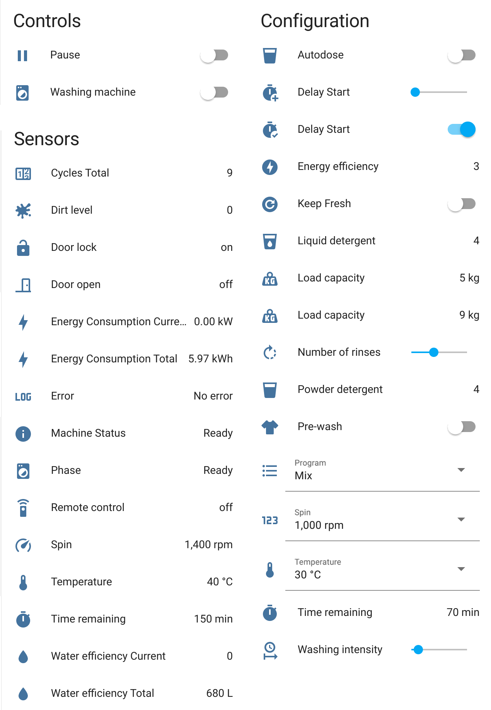

# Haier hOn
[](https://hacs.xyz)
[](https://github.com/Andre0512/hon/releases/latest)
[](https://github.com/Andre0512/pyhOn)
[](https://github.com/Andre0512/hon/blob/main/LICENSE)
[](https://tooomm.github.io/github-release-stats/?username=Andre0512&repository=hon)  
Home Assistant integration for [Haier's mobile app hOn](https://hon-smarthome.com/) based on [pyhOn](https://github.com/Andre0512/pyhon).

## Supported Appliances
- [Washing Machine](https://github.com/Andre0512/hon#washing-machine)
- [Tumble Dryer](https://github.com/Andre0512/hon#tumble-dryer)
- [Washer Dryer](https://github.com/Andre0512/hon#washer-dryer)
- [Oven](https://github.com/Andre0512/hon#oven)
- [Dish Washer](https://github.com/Andre0512/hon#dish-washer)
- [Air conditioner](https://github.com/Andre0512/hon#air-conditioner)
- [Fridge](https://github.com/Andre0512/hon#fridge)
- [Induction Hob](https://github.com/Andre0512/hon#induction-hob) [BETA]
- [Hood](https://github.com/Andre0512/hon#hood) [BETA]
- [Wine Cellar](https://github.com/Andre0512/hon#wine-cellar) [BETA]
- [Air Purifier](https://github.com/Andre0512/hon#air-purifier) [BETA]

## Installation
**Method 1:** [](https://my.home-assistant.io/redirect/hacs_repository/?owner=Andre0512&repository=hon&category=integration)

**Method 2:** [HACS](https://hacs.xyz/) > Integrations > Add Integration > **Haier hOn** > Install  

**Method 3:** Manually copy `hon` folder from [latest release](https://github.com/Andre0512/hon/releases/latest) to `config/custom_components` folder.

_Restart Home Assistant_

## Configuration

**Method 1**: [](https://my.home-assistant.io/redirect/config_flow_start/?domain=hon)

**Method 2**: Settings > Devices & Services > Add Integration > **Haier hOn**  
_If the integration is not in the list, you need to clear the browser cache._

## Supported Models
Support has been confirmed for these models, but many more will work. Please add already supported devices [with this form to complete the list](https://forms.gle/bTSD8qFotdZFytbf8).

|                     | **Haier**                                                                                                                                                                                                  | **Hoover**                                                                                                                                  | **Candy**                                                                                           |
|---------------------|------------------------------------------------------------------------------------------------------------------------------------------------------------------------------------------------------------|---------------------------------------------------------------------------------------------------------------------------------------------|-----------------------------------------------------------------------------------------------------|
| **Washing Machine** | HW80-B14959TU1DE <br/> HW90-B14TEAM5 <br/> HW100-B14959U1                                                                                                                                                  | H-WASH 500 <br/> H7W4 48MBC-S <br/> HW 410AMBCB/1-80                                                                                        | CO4 107T1/2-07 <br/> CBWO49TWME-S <br/> RO44 1286DWMC4-07 <br/> HW 68AMC/1-80 <br/> HWPD 69AMBC/1-S |
| **Tumble Dryer**    | HD80-A3959                                                                                                                                                                                                 | H-DRY 500 <br/> H9A3TCBEXS-S <br/> HLE C10DCE-80 <br/> H5WPB447AMBC/1-S <br/> NDE H10A2TCE-80 <br/> NDE H9A2TSBEXS-S <br/> NDPHY10A2TCBEXSS | BCTDH7A1TE <br/> CSOE C10DE-80 <br/> ROE H9A3TCEX-S                                                 |
| **Washer Dryer**    | HWD100-B14979                                                                                                                                                                                              | HDQ 496AMBS/1-S <br/> HWPS4954DAMR-11                                                                                                       | RPW41066BWMR/1-S                                                                                    |
| **Oven**            | HWO60SM2F3XH                                                                                                                                                                                               | HSOT3161WG                                                                                                                                  |                                                                                                     |
| **Dish Washer**     | XIB 3B2SFS-80 <br/> XIB 6B2D3FB                                                                                                                                                                            | HFB 6B2S3FX                                                                                                                                 |                                                                                                     |
| **Air Conditioner** | AD105S2SM3FA <br/> AS09TS4HRA-M <br/> AS20HPL1HRA <br/> AS25PBAHRA <br/> AS25S2SF1FA-WH <br/> AS25TADHRA-2 <br/> AS35PBAHRA <br/> AS35S2SF1FA-WH <br/> AS35S2SF2FA-3 <br/> AS35TADHRA-2 <br/> AS35TAMHRA-C |                                                                                                                                             |                                                                                                     |
| **Fridge**          | HFW7720ENMB                                                                                                                                                                                                |                                                                                                                                             | CCE4T620EWU                                                                                         |
| **Hob**             | HA2MTSJ68MC                                                                                                                                                                                                |                                                                                                                                             | CIS633SCTTWIFI                                                                                      |
| **Hood**            | HADG6DS46BWIFI                                                                                                                                                                                             |                                                                                                                                             |                                                                                                     |
| **Wine Cellar**     | HWS247FDU1                                                                                                                                                                                                 |                                                                                                                                             |                                                                                                     |
| **Air Purifier**    |                                                                                                                                                                                                            | HHP50CA001                                                                                                                                  |                                                                                                     |


| Please add your appliances data to our [hon-test-data collection](https://github.com/Andre0512/hon-test-data). <br/>This helps us to develop new features and not to break compatibility in newer versions. |
|-------------------------------------------------------------------------------------------------------------------------------------------------------------------------------------------------------------|

## Supported Languages
Translation of internal names like programs are available for all languages which are official supported by the hOn app:
* 🇨🇳 Chinese
* 🇭🇷 Croatian
* 🇨🇿 Czech
* 🇳🇱 Dutch
* 🇬🇧 English
* 🇫🇷 French
* 🇩🇪 German
* 🇬🇷 Greek
* 🇮🇱 Hebrew
* 🇮🇹 Italian
* 🇵🇱 Polish
* 🇵🇹 Portuguese
* 🇷🇴 Romanian
* 🇷🇺 Russian
* 🇷🇸 Serbian
* 🇸🇰 Slovak
* 🇸🇮 Slovenian
* 🇪🇸 Spanish
* 🇹🇷 Turkish

## Examples
### Washing Machine


## Contribute
Any kind of contribution is welcome!
### Read out device data
If you want to make a request for adding new appliances or additional attributes and don't want to use the command line, here is how you can read out your device data.
For every device exists a button under diagnostics which can be used to log all info of your appliance.
1. Press the button to create a notification
2. Open home assistant notifications and copy the message (Crtl+A, Ctrl+C)
### Add appliances or additional attributes
1. Install [pyhOn](https://github.com/Andre0512/pyhOn)
   ```commandline
    $ pip install pyhOn
    ```
2. Use the command line tool to read out all appliance data from your account
    ```commandline
    $ pyhOn
    User for hOn account: user.name@example.com
    Password for hOn account: ********
    ========== WM - Washing Machine ==========
    commands:
      pauseProgram: pauseProgram command
      resumeProgram: resumeProgram command
      startProgram: startProgram command
      stopProgram: stopProgram command
    data:
      actualWeight: 0
      airWashTempLevel: 0
      airWashTime: 0
      antiAllergyStatus: 0
      ...
    ```
3. Fork this repository and clone it to your local machine
4. Add the keys of the attributes you'd like to have as `EntityDescription` into this Repository  
   _Example: Add pause button_
    ```python
    BUTTONS: dict[str, tuple[ButtonEntityDescription, ...]] = {
        "WM": (                        # WM is the applianceTypeName
            ButtonEntityDescription(
                key="pauseProgram",    # key from pyhOn
                name="Pause Program",  # name in home assistant
                icon="mdi:pause",      # icon in home assistant
                ...
            ),
        ...
    ```
5. Create a [pull request](https://github.com/Andre0512/hon/pulls)

#### Tips and Tricks
- If you want to have some states humanreadable, have a look at the `translation_key` parameter of the `EntityDescription`.
- If you need to implement some more logic, create a pull request to the underlying library. There we collect special requirements in the `appliances` directory.
- Use [pyhOn's translate command](https://github.com/Andre0512/pyhOn#translation) to read out the official translations

## Special Thanks
- to [@alexandre-leites](https://github.com/alexandre-leites), [@MiguelAngelLV](https://github.com/MiguelAngelLV) and [@drudgebg](https://github.com/drudgebg) for contributing early to this project and adding new integrations.
- to [gvigroux/hon](https://github.com/gvigroux/hon), [signalize/hon-app-research](https://github.com/signalize/hon-app-research) and [slegars56/hon](https://github.com/slegars56/hon) for inspiring me to do this integration and for doing pioneer work on the hOn api.
- to everyone who contributed, created an issue, gave this repo a star, and used this integration.
- to the patience of my girlfriend as I work on this integration.

## Appliance Features

### Air Conditioner
#### Controls
| Name | Icon | Entity | Key |
| --- | --- | --- | --- |
| 10° Heating | `heat-wave` | `switch` | `10degreeHeatingStatus` |
| Air Conditioner | `air-conditioner` | `climate` | `settings` |
| Echo | `account-voice` | `switch` | `echoStatus` |
| Eco Mode | `sprout` | `switch` | `ecoMode` |
| Eco Pilot | `run` | `select` | `settings.humanSensingStatus` |
| Health Mode | `medication-outline` | `switch` | `healthMode` |
| Night Mode | `bed` | `switch` | `silentSleepStatus` |
| Rapid Mode | `run-fast` | `switch` | `rapidMode` |
| Screen Display | `monitor-small` | `switch` | `screenDisplayStatus` |
| Self Cleaning | `air-filter` | `switch` | `selfCleaningStatus` |
| Self Cleaning 56 | `air-filter` | `switch` | `selfCleaning56Status` |
| Silent Mode | `volume-off` | `switch` | `muteStatus` |
| Target Temperature | `thermometer` | `number` | `settings.tempSel` |
#### Sensors
| Name | Icon | Entity | Key |
| --- | --- | --- | --- |
| Air Temperature Outdoor | `thermometer` | `sensor` | `tempAirOutdoor` |
| Ch2O Cleaning |  | `binary_sensor` | `ch2oCleaningStatus` |
| Coiler Temperature Indoor | `thermometer` | `sensor` | `tempCoilerIndoor` |
| Coiler Temperature Outside | `thermometer` | `sensor` | `tempCoilerOutdoor` |
| Defrost Temperature Outdoor | `thermometer` | `sensor` | `tempDefrostOutdoor` |
| Filter Replacement |  | `binary_sensor` | `filterChangeStatusLocal` |
| In Air Temperature Outdoor | `thermometer` | `sensor` | `tempInAirOutdoor` |
| Indoor Temperature | `thermometer` | `sensor` | `tempIndoor` |
| Machine Status | `information` | `sensor` | `machMode` |
| Outdoor Temperature | `thermometer` | `sensor` | `tempOutdoor` |
| Program |  | `select` | `startProgram.program` |
| Program | `play` | `sensor` | `programName` |
| Selected Temperature | `thermometer` | `sensor` | `tempSel` |

### Air Purifier
#### Controls
| Name | Icon | Entity | Key |
| --- | --- | --- | --- |
| Aroma Time Off | `scent-off` | `number` | `settings.aromaTimeOff` |
| Aroma Time On | `scent` | `number` | `settings.aromaTimeOn` |
| Diffuser Level | `air-purifier` | `select` | `settings.aromaStatus` |
| Light status |  | `light` | `settings.lightStatus` |
| Lock Status |  | `lock` | `lockStatus` |
| Mode | `play` | `select` | `settings.machMode` |
| Pollen Level | `flower-pollen` | `number` | `settings.pollenLevel` |
| Touch Tone | `account-voice` | `switch` | `touchToneStatus` |
#### Sensors
| Name | Icon | Entity | Key |
| --- | --- | --- | --- |
| Air Quality | `weather-dust` | `sensor` | `airQuality` |
| CO Level |  | `sensor` | `coLevel` |
| Error | `math-log` | `sensor` | `errors` |
| Humidity |  | `sensor` | `humidityIndoor` |
| Main Filter Status | `air-filter` | `sensor` | `mainFilterStatus` |
| On | `power-cycle` | `binary_sensor` | `attributes.parameters.onOffStatus` |
| PM 10 |  | `sensor` | `pm10ValueIndoor` |
| PM 2.5 |  | `sensor` | `pm2p5ValueIndoor` |
| Pre Filter Status | `air-filter` | `sensor` | `preFilterStatus` |
| Temperature |  | `sensor` | `temp` |
| Total Work Time |  | `sensor` | `totalWorkTime` |
| VOC |  | `sensor` | `vocValueIndoor` |
| Wind Speed | `fan` | `sensor` | `windSpeed` |

### Dish Washer
#### Controls
| Name | Icon | Entity | Key |
| --- | --- | --- | --- |
| Buzzer Disabled | `volume-off` | `switch` | `buzzerDisabled` |
| Dish Washer | `dishwasher` | `switch` | `startProgram` / `stopProgram` |
#### Configs
| Name | Icon | Entity | Key |
| --- | --- | --- | --- |
| Add Dish | `silverware-fork-knife` | `switch` | `startProgram.addDish` |
| Delay time | `timer-plus` | `number` | `startProgram.delayTime` |
| Eco Express | `sprout` | `switch` | `startProgram.ecoExpress` |
| Eco Index | `sprout` | `sensor` | `startProgram.ecoIndex` |
| Energy Label | `lightning-bolt-circle` | `sensor` | `startProgram.energyLabel` |
| Extra Dry | `hair-dryer` | `switch` | `startProgram.extraDry` |
| Half Load | `fraction-one-half` | `switch` | `startProgram.halfLoad` |
| Open Door | `door-open` | `switch` | `startProgram.openDoor` |
| Program |  | `select` | `startProgram.program` |
| Remaining Time | `timer` | `select` | `startProgram.remainingTime` |
| Temperature | `thermometer` | `select` | `startProgram.temp` |
| Temperature | `thermometer` | `sensor` | `startProgram.temp` |
| Three in One | `numeric-3-box-outline` | `switch` | `startProgram.threeInOne` |
| Time | `timer` | `sensor` | `startProgram.remainingTime` |
| Water Efficiency | `water` | `sensor` | `startProgram.waterEfficiency` |
| Water Saving | `water-percent` | `sensor` | `startProgram.waterSaving` |
| Water hard | `water` | `number` | `startProgram.waterHard` |
#### Sensors
| Name | Icon | Entity | Key |
| --- | --- | --- | --- |
| Connection |  | `binary_sensor` | `attributes.lastConnEvent.category` |
| Door |  | `binary_sensor` | `doorStatus` |
| Error | `math-log` | `sensor` | `errors` |
| Machine Status | `information` | `sensor` | `machMode` |
| Program | `play` | `sensor` | `programName` |
| Program Phase | `washing-machine` | `sensor` | `prPhase` |
| Remaining Time | `timer` | `sensor` | `remainingTimeMM` |
| Rinse Aid | `spray-bottle` | `binary_sensor` | `rinseAidStatus` |
| Salt | `shaker-outline` | `binary_sensor` | `saltStatus` |

### Hood
#### Controls
| Name | Icon | Entity | Key |
| --- | --- | --- | --- |
| Light status |  | `light` | `startProgram.lightStatus` |
| Start Program | `hvac` | `button` | `startProgram` |
| Stop Program | `hvac-off` | `button` | `stopProgram` |
| Wind Speed |  | `fan` | `settings.windSpeed` |
#### Sensors
| Name | Icon | Entity | Key |
| --- | --- | --- | --- |
| Delay time | `clock-start` | `sensor` | `delayTime` |
| Delay time status | `clock-start` | `sensor` | `delayTimeStatus` |
| Errors | `alert-circle` | `sensor` | `errors` |
| Filter Cleaning Alarm Status |  | `sensor` | `filterCleaningAlarmStatus` |
| Filter Cleaning Status |  | `sensor` | `filterCleaningStatus` |
| Last Work Time | `clock-start` | `sensor` | `lastWorkTime` |
| Light Status | `lightbulb` | `sensor` | `lightStatus` |
| Mach Mode |  | `sensor` | `machMode` |
| On / Off Status | `lightbulb` | `sensor` | `onOffStatus` |
| Quick Delay Time Status |  | `sensor` | `quickDelayTimeStatus` |
| RGB Light Color | `lightbulb` | `sensor` | `rgbLightColors` |
| RGB Light Status | `lightbulb` | `sensor` | `rgbLightStatus` |

### Induction Hob
#### Controls
| Name | Icon | Entity | Key |
| --- | --- | --- | --- |
| Start Program | `pot-steam` | `button` | `startProgram` |
#### Configs
| Name | Icon | Entity | Key |
| --- | --- | --- | --- |
| Power Management | `timelapse` | `number` | `startProgram.powerManagement` |
| Program |  | `select` | `startProgram.program` |
| Temperature | `thermometer` | `number` | `startProgram.temp` |
#### Sensors
| Name | Icon | Entity | Key |
| --- | --- | --- | --- |
| Connection | `wifi` | `binary_sensor` | `attributes.lastConnEvent.category` |
| Error | `math-log` | `sensor` | `errors` |
| Hob Lock |  | `binary_sensor` | `hobLockStatus` |
| Hot Status |  | `binary_sensor` | `hotStatus` |
| On | `power-cycle` | `binary_sensor` | `attributes.parameters.onOffStatus` |
| Pan Status | `pot-mix` | `binary_sensor` | `panStatus` |
| Power | `lightning-bolt` | `sensor` | `power` |
| Program | `play` | `sensor` | `programName` |
| Remaining Time | `timer` | `sensor` | `remainingTimeMM` |
| Temperature | `thermometer` | `sensor` | `temp` |

### Oven
#### Controls
| Name | Icon | Entity | Key |
| --- | --- | --- | --- |
| Oven | `thermometer` | `climate` | `settings.tempSel` |
| Oven | `toaster-oven` | `switch` | `startProgram` / `stopProgram` |
#### Configs
| Name | Icon | Entity | Key |
| --- | --- | --- | --- |
| Delay time | `timer-plus` | `number` | `startProgram.delayTime` |
| Preheat | `thermometer-chevron-up` | `switch` | `startProgram.preheatStatus` |
| Program |  | `select` | `startProgram.program` |
| Program Duration | `timelapse` | `number` | `startProgram.prTime` |
| Target Temperature | `thermometer` | `number` | `startProgram.tempSel` |
#### Sensors
| Name | Icon | Entity | Key |
| --- | --- | --- | --- |
| Connection | `wifi` | `binary_sensor` | `attributes.lastConnEvent.category` |
| On | `power-cycle` | `binary_sensor` | `attributes.parameters.onOffStatus` |
| Program | `play` | `sensor` | `programName` |
| Remaining Time | `timer` | `sensor` | `remainingTimeMM` |
| Start Time | `clock-start` | `sensor` | `delayTime` |
| Temperature | `thermometer` | `sensor` | `temp` |
| Temperature Selected | `thermometer` | `sensor` | `tempSel` |

### Fridge
#### Controls
| Name | Icon | Entity | Key |
| --- | --- | --- | --- |
| Auto-Set Mode | `thermometer-auto` | `switch` | `intelligenceMode` |
| Freezer | `snowflake-thermometer` | `climate` | `settings.tempSelZ2` |
| Freezer Temperature | `thermometer` | `number` | `settings.tempSelZ2` |
| Fridge | `thermometer` | `climate` | `settings.tempSelZ1` |
| Fridge Temperature | `thermometer` | `number` | `settings.tempSelZ1` |
| Holiday Mode | `palm-tree` | `switch` | `holidayMode` |
| Program Start | `play` | `button` | `startProgram` |
| Program Stop | `stop` | `button` | `stopProgram` |
| Super Cool | `snowflake` | `switch` | `quickModeZ2` |
| Super Freeze | `snowflake-variant` | `switch` | `quickModeZ1` |
#### Configs
| Name | Icon | Entity | Key |
| --- | --- | --- | --- |
| Program |  | `select` | `startProgram.program` |
| Zone | `radiobox-marked` | `select` | `startProgram.zone` |
#### Sensors
| Name | Icon | Entity | Key |
| --- | --- | --- | --- |
| Auto-Set Mode | `thermometer-auto` | `binary_sensor` | `intelligenceMode` |
| Door Status Freezer | `fridge-top` | `binary_sensor` | `doorStatusZ1` |
| Door Status Fridge | `fridge-bottom` | `binary_sensor` | `door2StatusZ1` |
| Error | `math-log` | `sensor` | `errors` |
| Holiday Mode | `palm-tree` | `binary_sensor` | `holidayMode` |
| Room Humidity | `water-percent` | `sensor` | `humidityEnv` |
| Room Temperature | `home-thermometer-outline` | `sensor` | `tempEnv` |
| Super Cool | `snowflake` | `binary_sensor` | `quickModeZ2` |
| Super Freeze | `snowflake-variant` | `binary_sensor` | `quickModeZ1` |
| Temperature Freezer | `snowflake-thermometer` | `sensor` | `tempZ2` |
| Temperature Fridge | `thermometer` | `sensor` | `tempZ1` |

### Tumble Dryer
#### Controls
| Name | Icon | Entity | Key |
| --- | --- | --- | --- |
| Pause Tumble Dryer | `pause` | `switch` | `pauseProgram` / `resumeProgram` |
| Tumble Dryer | `tumble-dryer` | `switch` | `startProgram` / `stopProgram` |
#### Configs
| Name | Icon | Entity | Key |
| --- | --- | --- | --- |
| Anti-Crease | `iron` | `switch` | `startProgram.antiCreaseTime` |
| Anti-Crease | `iron` | `switch` | `startProgram.anticrease` |
| Delay time | `timer-plus` | `number` | `startProgram.delayTime` |
| Dry Time |  | `number` | `startProgram.dryTime` |
| Dry Time | `timer` | `select` | `startProgram.dryTimeMM` |
| Dry level | `hair-dryer` | `select` | `startProgram.dryLevel` |
| Energy Label | `lightning-bolt-circle` | `sensor` | `startProgram.energyLabel` |
| Program |  | `select` | `startProgram.program` |
| Steam Type | `weather-dust` | `sensor` | `steamType` |
| Sterilization | `clock-start` | `switch` | `startProgram.sterilizationStatus` |
| Suggested Load | `weight-kilogram` | `sensor` | `startProgram.suggestedLoadD` |
| Temperature level | `thermometer` | `number` | `startProgram.tempLevel` |
#### Sensors
| Name | Icon | Entity | Key |
| --- | --- | --- | --- |
| Anti-Crease | `iron` | `binary_sensor` | `anticrease` |
| Connection |  | `binary_sensor` | `attributes.lastConnEvent.category` |
| Door |  | `binary_sensor` | `doorStatus` |
| Dry level | `hair-dryer` | `sensor` | `dryLevel` |
| Error | `math-log` | `sensor` | `errors` |
| Machine Status | `information` | `sensor` | `machMode` |
| Program | `play` | `sensor` | `programName` |
| Program Phase | `washing-machine` | `sensor` | `prPhase` |
| Remaining Time | `timer` | `sensor` | `remainingTimeMM` |
| Start Time | `clock-start` | `sensor` | `delayTime` |
| Temperature level | `thermometer` | `sensor` | `tempLevel` |

### Wine Cellar
#### Controls
| Name | Icon | Entity | Key |
| --- | --- | --- | --- |
| Light |  | `light` | `settings.lightStatus` |
| Sabbath Mode | `palm-tree` | `switch` | `sabbathStatus` |
| Wine Cellar | `thermometer` | `climate` | `settings.tempSel` |
| Wine Cellar | `thermometer` | `climate` | `settings.tempSelZ2` |
#### Sensors
| Name | Icon | Entity | Key |
| --- | --- | --- | --- |
| Error | `math-log` | `sensor` | `errors` |
| Humidity | `water-percent` | `sensor` | `humidityZ1` |
| Humidity 2 | `water-percent` | `sensor` | `humidityZ2` |
| Program | `play` | `sensor` | `programName` |
| Room Temperature | `home-thermometer-outline` | `sensor` | `tempEnv` |
| Selected Temperature | `thermometer` | `sensor` | `tempSel` |
| Selected Temperature 2 | `thermometer` | `sensor` | `tempSelZ2` |
| Temperature | `thermometer` | `sensor` | `temp` |
| Temperature 2 | `thermometer` | `sensor` | `tempZ2` |

### Washer Dryer
#### Controls
| Name | Icon | Entity | Key |
| --- | --- | --- | --- |
| Pause Washer Dryer | `pause` | `switch` | `pauseProgram` / `resumeProgram` |
| Washer Dryer | `washing-machine` | `switch` | `startProgram` / `stopProgram` |
#### Configs
| Name | Icon | Entity | Key |
| --- | --- | --- | --- |
| Acqua Plus | `water-plus` | `switch` | `startProgram.acquaplus` |
| Anti-Crease | `iron` | `switch` | `startProgram.antiCreaseTime` |
| Anti-Crease | `iron` | `switch` | `startProgram.anticrease` |
| Auto Dose Detergent | `cup` | `switch` | `startProgram.autoDetergentStatus` |
| Auto Dose Softener | `teddy-bear` | `switch` | `startProgram.autoSoftenerStatus` |
| Delay Status | `timer-check` | `switch` | `startProgram.delayStatus` |
| Delay Time | `timer-plus` | `number` | `startProgram.delayTime` |
| Dirty level | `liquid-spot` | `select` | `startProgram.dirtyLevel` |
| Dry Time |  | `number` | `startProgram.dryTime` |
| Dry Time | `timer` | `select` | `startProgram.dryTimeMM` |
| Dry level | `hair-dryer` | `select` | `startProgram.dryLevel` |
| Energy Label | `lightning-bolt-circle` | `sensor` | `startProgram.energyLabel` |
| Extra Rinse 1 | `numeric-1-box-multiple-outline` | `switch` | `startProgram.extraRinse1` |
| Extra Rinse 2 | `numeric-2-box-multiple-outline` | `switch` | `startProgram.extraRinse2` |
| Extra Rinse 3 | `numeric-3-box-multiple-outline` | `switch` | `startProgram.extraRinse3` |
| Good Night | `weather-night` | `switch` | `startProgram.goodNight` |
| Hygiene | `lotion-plus` | `switch` | `startProgram.hygiene` |
| Keep Fresh | `refresh-circle` | `switch` | `startProgram.permanentPressStatus` |
| Liquid Detergent Dose | `cup-water` | `sensor` | `startProgram.liquidDetergentDose` |
| Main Wash Time | `clock-start` | `number` | `startProgram.mainWashTime` |
| Powder Detergent Dose | `cup` | `sensor` | `startProgram.powderDetergentDose` |
| Program |  | `select` | `startProgram.program` |
| Remaining Time | `timer` | `sensor` | `startProgram.remainingTime` |
| Rinse Iterations | `rotate-right` | `number` | `startProgram.rinseIterations` |
| Soak Prewash Selection | `tshirt-crew` | `switch` | `startProgram.haier_SoakPrewashSelection` |
| Spin speed | `numeric` | `select` | `startProgram.spinSpeed` |
| Steam Type | `weather-dust` | `sensor` | `steamType` |
| Steam level | `weather-dust` | `select` | `startProgram.steamLevel` |
| Sterilization | `clock-start` | `switch` | `startProgram.sterilizationStatus` |
| Suggested Load | `weight-kilogram` | `sensor` | `startProgram.suggestedLoadW` |
| Suggested Load | `weight-kilogram` | `sensor` | `startProgram.suggestedLoadD` |
| Suggested weight | `weight-kilogram` | `sensor` | `startProgram.weight` |
| Temperature | `thermometer` | `select` | `startProgram.temp` |
| Temperature level | `thermometer` | `number` | `startProgram.tempLevel` |
| Water hard | `water` | `number` | `startProgram.waterHard` |
| lang |  | `number` | `startProgram.lang` |
#### Sensors
| Name | Icon | Entity | Key |
| --- | --- | --- | --- |
| Acqua Plus | `water-plus` | `binary_sensor` | `acquaplus` |
| Anti-Crease | `iron` | `binary_sensor` | `anticrease` |
| Current Electricity Used | `lightning-bolt` | `sensor` | `currentElectricityUsed` |
| Current Temperature | `thermometer` | `sensor` | `temp` |
| Current Water Used | `water` | `sensor` | `currentWaterUsed` |
| Dirty level | `liquid-spot` | `sensor` | `dirtyLevel` |
| Door |  | `binary_sensor` | `doorStatus` |
| Door Lock |  | `binary_sensor` | `doorLockStatus` |
| Dry level | `hair-dryer` | `sensor` | `dryLevel` |
| Error | `math-log` | `sensor` | `errors` |
| Extra Rinse 1 | `numeric-1-box-multiple-outline` | `binary_sensor` | `extraRinse1` |
| Extra Rinse 2 | `numeric-2-box-multiple-outline` | `binary_sensor` | `extraRinse2` |
| Extra Rinse 3 | `numeric-3-box-multiple-outline` | `binary_sensor` | `extraRinse3` |
| Good Night Mode | `weather-night` | `binary_sensor` | `goodNight` |
| Machine Status | `information` | `sensor` | `machMode` |
| Pre Wash | `tshirt-crew` | `binary_sensor` | `prewash` |
| Program | `play` | `sensor` | `programName` |
| Program Phase | `washing-machine` | `sensor` | `prPhase` |
| Remaining Time | `timer` | `sensor` | `remainingTimeMM` |
| Remote Control | `remote` | `binary_sensor` | `attributes.lastConnEvent.category` |
| Spin Speed | `speedometer` | `sensor` | `spinSpeed` |
| Start Time | `clock-start` | `sensor` | `delayTime` |
| Steam level | `weather-dust` | `sensor` | `steamLevel` |
| Temperature level | `thermometer` | `sensor` | `tempLevel` |
| Total Power |  | `sensor` | `totalElectricityUsed` |
| Total Wash Cycle | `counter` | `sensor` | `totalWashCycle` |
| Total Water |  | `sensor` | `totalWaterUsed` |

### Washing Machine
#### Controls
| Name | Icon | Entity | Key |
| --- | --- | --- | --- |
| Pause Washing Machine | `pause` | `switch` | `pauseProgram` / `resumeProgram` |
| Washing Machine | `washing-machine` | `switch` | `startProgram` / `stopProgram` |
#### Configs
| Name | Icon | Entity | Key |
| --- | --- | --- | --- |
| Acqua Plus | `water-plus` | `switch` | `startProgram.acquaplus` |
| Auto Dose Detergent | `cup` | `switch` | `startProgram.autoDetergentStatus` |
| Auto Dose Softener | `teddy-bear` | `switch` | `startProgram.autoSoftenerStatus` |
| Delay Status | `timer-check` | `switch` | `startProgram.delayStatus` |
| Delay Time | `timer-plus` | `number` | `startProgram.delayTime` |
| Dirty level | `liquid-spot` | `select` | `startProgram.dirtyLevel` |
| Energy Label | `lightning-bolt-circle` | `sensor` | `startProgram.energyLabel` |
| Extra Rinse 1 | `numeric-1-box-multiple-outline` | `switch` | `startProgram.extraRinse1` |
| Extra Rinse 2 | `numeric-2-box-multiple-outline` | `switch` | `startProgram.extraRinse2` |
| Extra Rinse 3 | `numeric-3-box-multiple-outline` | `switch` | `startProgram.extraRinse3` |
| Good Night | `weather-night` | `switch` | `startProgram.goodNight` |
| Hygiene | `lotion-plus` | `switch` | `startProgram.hygiene` |
| Keep Fresh | `refresh-circle` | `switch` | `startProgram.permanentPressStatus` |
| Liquid Detergent Dose | `cup-water` | `sensor` | `startProgram.liquidDetergentDose` |
| Main Wash Time | `clock-start` | `number` | `startProgram.mainWashTime` |
| Powder Detergent Dose | `cup` | `sensor` | `startProgram.powderDetergentDose` |
| Program |  | `select` | `startProgram.program` |
| Remaining Time | `timer` | `sensor` | `startProgram.remainingTime` |
| Rinse Iterations | `rotate-right` | `number` | `startProgram.rinseIterations` |
| Soak Prewash Selection | `tshirt-crew` | `switch` | `startProgram.haier_SoakPrewashSelection` |
| Spin speed | `numeric` | `select` | `startProgram.spinSpeed` |
| Steam level | `weather-dust` | `select` | `startProgram.steamLevel` |
| Suggested Load | `weight-kilogram` | `sensor` | `startProgram.suggestedLoadW` |
| Suggested weight | `weight-kilogram` | `sensor` | `startProgram.weight` |
| Temperature | `thermometer` | `select` | `startProgram.temp` |
| Water hard | `water` | `number` | `startProgram.waterHard` |
| lang |  | `number` | `startProgram.lang` |
#### Sensors
| Name | Icon | Entity | Key |
| --- | --- | --- | --- |
| Acqua Plus | `water-plus` | `binary_sensor` | `acquaplus` |
| Current Electricity Used | `lightning-bolt` | `sensor` | `currentElectricityUsed` |
| Current Temperature | `thermometer` | `sensor` | `temp` |
| Current Water Used | `water` | `sensor` | `currentWaterUsed` |
| Dirty level | `liquid-spot` | `sensor` | `dirtyLevel` |
| Door |  | `binary_sensor` | `doorStatus` |
| Door Lock |  | `binary_sensor` | `doorLockStatus` |
| Error | `math-log` | `sensor` | `errors` |
| Extra Rinse 1 | `numeric-1-box-multiple-outline` | `binary_sensor` | `extraRinse1` |
| Extra Rinse 2 | `numeric-2-box-multiple-outline` | `binary_sensor` | `extraRinse2` |
| Extra Rinse 3 | `numeric-3-box-multiple-outline` | `binary_sensor` | `extraRinse3` |
| Good Night Mode | `weather-night` | `binary_sensor` | `goodNight` |
| Machine Status | `information` | `sensor` | `machMode` |
| Pre Wash | `tshirt-crew` | `binary_sensor` | `prewash` |
| Program | `play` | `sensor` | `programName` |
| Program Phase | `washing-machine` | `sensor` | `prPhase` |
| Remaining Time | `timer` | `sensor` | `remainingTimeMM` |
| Remote Control | `remote` | `binary_sensor` | `attributes.lastConnEvent.category` |
| Spin Speed | `speedometer` | `sensor` | `spinSpeed` |
| Steam level | `weather-dust` | `sensor` | `steamLevel` |
| Total Power |  | `sensor` | `totalElectricityUsed` |
| Total Wash Cycle | `counter` | `sensor` | `totalWashCycle` |
| Total Water |  | `sensor` | `totalWaterUsed` |
