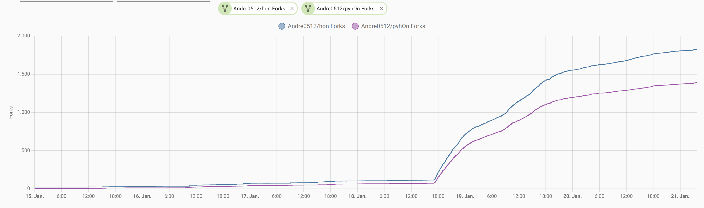
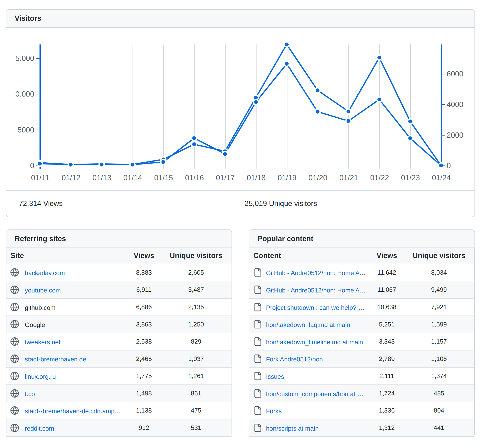

## Timeline of events

### 2024-01-15
hon | 98 Stars | 23 Forks  
pyhOn | 17 Stars | 5 Forks  

- Haier wrote the [takedown mail](https://github.com/Andre0512/hon/blob/main/takedown_faq.md#what-did-haier-wrote)
- [Replied](https://github.com/Andre0512/hon/blob/main/takedown_faq.md#what-did-you-answer-haier) that I take it down in the next days
- [Updated](https://github.com/Andre0512/hon/commit/14f133f3f471bf0b46a7ba3cd2e524b45446d125) the README of Andre0512/pyhOn and Andre0512/hon
- Created a [new release](https://github.com/Andre0512/hon/releases/tag/v0.11.0) with takedown info, so people know why it was removed
- Posted the info to the [community board](https://community.home-assistant.io/t/integration-with-haier-hon-app/322490/159?u=andre0512)
- Talked to some friends that convinced me to not give up
- Asked on the home assistant discord to how to handle this, got the info on discord that my integration does not violate the law
- [Extreme79](https://github.com/Extreme79) created an [the issue #147](https://github.com/Andre0512/hon/issues/147) to disscuss how to help
- People started to fork, copying the code to other hosting platforms and save it offline
- Talked to my law insurance and after a talk with a general lawyer I have been given permission to consult a lawyer of my choice

### 2024-01-16
hon | 100 Stars | 32 Forks  
pyhOn | 18 Stars | 13 Forks  

- People in [#147](https://github.com/Andre0512/hon/issues/147) started to write their opinion to Haier on all available channels (X, mails, support form, reviews, ...)
- [u/Waluicel](https://www.reddit.com/user/Waluicel/) created [a post](https://www.reddit.com/r/homeassistant/comments/197xc0m/haier_is_shutting_down_the_hacs_integration_hon/) on [r/homeassistant](https://www.reddit.com/r/homeassistant) that got 400+ comments
- People started to contact journalists and organizations to help
- Had a call with an IT lawyer who pointed out many of the risks I was exposing myself to despite having insurance

### 2024-01-17
hon | 111 Stars | 73 Forks  
pyhOn | 20 Stars | 42 Forks  

- [hectorzin](https://github.com/hectorzin) created a first [YouTube video](https://www.youtube.com/watch?v=u2rEVW0grsk)

### 2024-01-18
hon | 122 Stars | 103 Forks  
pyhOn | 23 Stars | 64 Forks  

- Louis Rossmann [created a video](https://www.youtube.com/watch?v=RcSnd3cyti0) and calls for "not" forking
- Forks and stars of the repos started to blow up
- BleepingComputer published an [article about the topic](https://www.bleepingcomputer.com/news/security/haier-hits-home-assistant-plugin-dev-with-takedown-notice/)
- Home Assistant team got in touch with me
- Wrote Haier [another mail](https://github.com/Andre0512/hon/blob/main/takedown_faq.md#what-did-you-answer-haier) and tried to get some clarification and reach some agreement
- [l00ps](https://github.com/l00ps) pointed out [who's the opponent](https://github.com/Andre0512/hon/issues/147#issuecomment-1899191758) (Haier CEO has a crazy history xD)
- Forms like [Reddit](https://www.reddit.com/r/homeassistant/comments/199uzbu/haier_attacks_home_assistant_destroys_open_source/), [Hacker News](https://news.ycombinator.com/item?id=39044932), [HA Community](https://community.home-assistant.io/t/haier-hits-home-assistant-plugin-dev-with-takedown-notice-lets-fork/675784), [linux.org.ru](https://www.linux.org.ru/news/opensource/17493319), [Hubitat](https://community.hubitat.com/t/haier-europe-sends-take-down-notice-to-ha-developer/132166), [femboys](https://femboys.bar/post/292973) started to discuss the topic

### 2024-01-19
hon | 321 Stars | 711 Forks  
pyhOn | 121 Stars | 552 Forks  

- Tech sites in many countries started to report about it eg [Hackaday](https://hackaday.com/2024/01/19/haier-threatens-legal-action-against-home-assistant-plugin-developer/), [Tweakers](https://tweakers.net/nieuws/217750/haier-stuurt-takedownverzoek-aan-home-assistant-plug-inontwikkelaar.html), [ilSoftware](https://www.ilsoftware.it/focus/smart-home-offline-per-svincolarsi-dagli-ecosistemi-chiusi-dei-singoli-produttori/), [ipFail](https://ipfail.org/broken-internet/haier-troll-vs-home-assistant/), [Scurt Pe Doi](https://scurtpedoi.ro/diverse/2024/haier-vs-home-assistant-controlul-open-source.html3), [iGeneration](https://www.igen.fr/domotique/2024/01/domotique-haier-veut-son-tour-bloquer-une-integration-dans-home-assistant-141587), [Smarthome Assistent](https://www.smarthomeassistent.de/home-assistant-haier-verbietet-den-einsatz-von-plugins/) and [Caschys Blog](https://stadt-bremerhaven.de/home-assistant-haier-geht-gegen-plugin-entwickler-vor/)
- The Wikipedia articles of [Haier](https://en.wikipedia.org/wiki/Haier#Controversy) and [List of Streisand effect examples](https://en.wikipedia.org/wiki/List_of_Streisand_effect_examples#By_businesses) gets updated
- [LauLaman](https://github.com/LauLaman) started [a petition in the Netherlands](https://www.petitie24.nl/petitie/5069/smart-home-lokaal-continu%C3%AFteit-en-veiligheid) _to force manufactories to provide local APIs and forcing them to opensource firmware as soon as they stop supporting devices_
- Linus Tech Tips [talked about it in his WAN Show](https://www.youtube.com/watch?v=FBQVPOSeRe8&t=6580s)
- Haier US [answered on X](https://www.reddit.com/r/homeassistant/comments/19a615l/haier_us_supports_home_assistant_and_open_iot/) that they have nothing to do with it and support open IOT platforms
- Haier Europe [created a blog post](https://corporate.haier-europe.com/press-release/hon-app-a-message-about-our-iot-and-ecosystem-vision/) and said they are _committed to enhancing the smart home scenarios in line with authorized usages and intellectual property rights of Haier Europe._  

### 2024-01-20
hon | 562 Stars | 1555 Forks  
pyhOn | 228 Stars | 1199 Forks  

- [Got an answer](https://github.com/Andre0512/hon/blob/main/takedown_faq.md#what-was-haiers-reaction) from Head of Brand & IOT Haier Europe, he proposed _scheduling a call involving our IOT Technology department to address the issue comprehensively and respond to any questions both parties may have._

### 2024-01-22 - 2024-01-27
hon | 779 Stars | 1948 Forks  
pyhOn | 315 Stars | 1477 Forks
- [Hackaday](https://hackaday.com/2024/01/22/haier-europe-eases-off-on-legal-threat-and-seeks-dialogue/), [Caschys Blog](https://stadt-bremerhaven.de/haier-und-home-assistant-es-koennte-weitergehen/) and [Tweakers](https://tweakers.net/nieuws/217840/haier-trekt-takedownverzoek-aan-plug-indeveloper-in-geeft-api-calls-de-schuld.html) posted a follow up article about Haier eases off on legal threat and seeking a dialogue
- [The Register](https://www.theregister.com/2024/01/22/haier_plugin_takedown/) and [heise online](https://www.heise.de/news/Hausgeraete-Hersteller-wollte-Open-Source-Projekt-loeschen-lassen-Loesung-in-Sicht-9606349.html) reported about the story
- [Everything Smart Home](https://www.youtube.com/watch?v=ayG7o74kdbc) and [Un loco y su tecnología](https://www.youtube.com/watch?v=P-kjoy1CS38) uploaded good summaries on YouTube
- [Hackaday](https://hackaday.com/2024/01/26/hackaday-podcast-episode-254-ai-hijack-guy-and-water-rockets-fly/#more-660935) discussed the topic in their podcast

### 2024-01-28 - 2024-02-04
hon | 1038 Stars | 2436 Forks  
pyhOn | 409 Stars | 1790 Forks
- Call with Haier and Paulus Schoutsen (Founder of Home Assistant) [to discuss things with the result to work together](https://github.com/Andre0512/hon/issues/147#issuecomment-1915355303)
- Released [v0.12.0](https://github.com/Andre0512/hon/releases/tag/v0.12.0) with 60 seconds polling
- [Haier replies](https://github.com/Andre0512/hon/issues/147#issuecomment-1923622715) to the complaint email of [AtomicFS](https://github.com/AtomicFS) and others

## Stats

